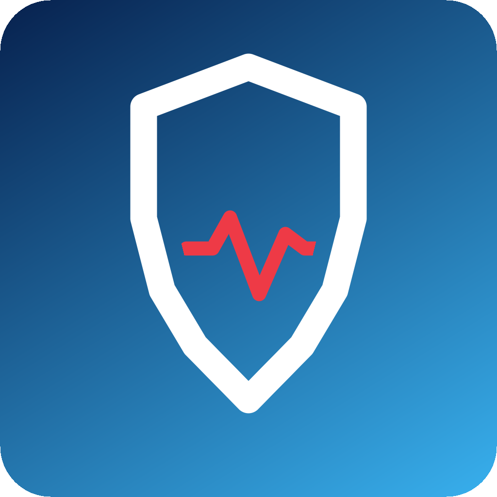

# Homebridge Health Monitor



Homebridge Health Monitor watches the configured Homebridge log file and exposes one HomeKit Leak Sensor named `Homebridge Health Monitor`.

When enough new anomalies are detected inside the rolling analysis window, the Leak Sensor reports a leak. After the configured reset delay passes without a new anomaly, the sensor returns to normal.

The plugin is intentionally small. It reads only the configured Homebridge log file, starts at the end of the file, ignores old lines, never writes to the log, never calls Homebridge UI private APIs, never reads system or Docker logs, and never executes system commands.

## Features

- Watches new lines appended to `homebridge.log`.
- Ignores existing lines on startup.
- Detects `ERROR` lines.
- Optionally counts `WARN` lines.
- Ignores logs generated by `homebridge-health-monitor`.
- Counts anomalies in a configurable rolling window.
- Triggers one HomeKit Leak Sensor when the threshold is reached.
- Automatically resets after a quiet period.
- Infers the source plugin from Homebridge log prefixes when possible.
- Stores a bounded JSON history of recent anomalies in the Homebridge storage directory.

## Compatibility

- Homebridge: `^1.6.0 || ^2.0.0`
- Node.js: `^22.12.0 || ^24.0.0`

This plugin does not require Homebridge UI. Homebridge UI is only used to render the configuration schema when it is installed.

## Installation

### Homebridge UI Installation

Search for `homebridge-health-monitor` in Homebridge UI and install it.

### npm Installation

```sh
npm install -g homebridge-health-monitor
```

### Local Development Installation

```sh
npm install
npm run build
```

## Homebridge UI Configuration

```json
{
  "platform": "HealthMonitor",
  "name": "Homebridge Health Monitor",
  "logFile": "/var/lib/homebridge/homebridge.log",
  "errorThreshold": 3,
  "analysisWindowSeconds": 300,
  "resetAfterSeconds": 600,
  "monitorWarnings": false,
  "scanIntervalSeconds": 5,
  "debug": false
}
```

If `logFile` is omitted, the plugin uses `homebridge.log` in the Homebridge storage directory.

## HomeKit Accessory

The plugin creates one Leak Sensor:

- no anomaly alert: leak = no;
- anomaly alert active: leak = yes.

This single accessory is the HomeKit automation signal.

## Log File Source

Only the configured Homebridge log file is monitored.

The plugin does not use:

- Homebridge UI private APIs;
- Homebridge UI log endpoints;
- `journalctl`;
- Docker commands;
- Docker logs;
- system logs;
- external log services.

If the log file does not exist or cannot be opened, the plugin logs a clear warning, keeps the Leak Sensor normal, and disables monitoring cleanly.

## Detection Rules

`ERROR` lines are always counted as anomalies.

`WARN` lines are counted only when `monitorWarnings` is enabled.

Logs generated by this plugin are ignored to prevent feedback loops.

When a Homebridge prefix is available, the plugin stores the source plugin in the anomaly history:

```text
[homebridge-camera] [ERROR] Stream failed
```

## Automatic Reset

Every counted anomaly refreshes the reset timer.

When `resetAfterSeconds` passes without a new anomaly, the Leak Sensor returns to normal. This reset timer is independent from the rolling analysis window.

## Persistent Anomaly History

The plugin stores the most recent anomalies in:

```text
homebridge-health-monitor-history.json
```

The file is stored in the Homebridge storage directory. It is diagnostic data only; the Leak Sensor alert state is runtime state.

## Restart Behavior

On startup, the plugin starts reading from the end of the configured log file. It does not analyze old lines that were already present.

The Leak Sensor starts normal after restart and reacts only to new anomalies.

## Troubleshooting

If no alerts are triggered:

- verify that `logFile` points to the actual Homebridge log file;
- confirm Homebridge can read the file;
- lower `errorThreshold` temporarily;
- enable `monitorWarnings` only if warning lines should count;
- enable `debug` for additional plugin logs.

## Security And Privacy

- No telemetry.
- No analytics.
- No cloud dependency.
- No command execution.
- No log file modification.
- No system or Docker log parsing.
- Bounded local JSON history only.

## Development

```sh
npm install
npm run lint
npm run build
npm test
npm run verify:pack
```

## Publishing

Do not publish to npm, create stable tags, or create GitHub Releases without explicit maintainer authorization.

GitHub Actions are provided for the release workflow:

- `CI`: runs lint, build, tests, and package verification on push and pull request.
- `Publish to npm`: publishes PR beta versions with the `beta` dist-tag for pull requests from this repository.
- `Publish to npm`: publishes alpha tag versions with the `alpha` dist-tag when a matching `v*-alpha.*` tag is pushed.
- `Publish to npm`: publishes stable versions through npm Trusted Publishing when a matching stable `v*` tag is pushed or when the workflow is manually dispatched.

Before creating an alpha or stable tag, make sure `package.json` already contains the exact target version. The tag must match the package version.

## Beta Versions

Pull request beta releases use the `beta` npm dist-tag and must never replace `latest`.

## Future Homebridge Verification

The plugin is designed with Homebridge Verified expectations in mind, but this README must not claim verified status until official verification is granted.

---

# Homebridge Health Monitor - Français

Homebridge Health Monitor surveille le fichier de log Homebridge configuré et expose un unique capteur HomeKit de type fuite nommé `Homebridge Health Monitor`.

Lorsqu'un nombre suffisant d'anomalies nouvelles est détecté dans la fenêtre d'analyse, le capteur signale une fuite. Après une durée configurable sans nouvelle anomalie, le capteur revient automatiquement à l'état normal.

Le plugin reste volontairement simple. Il lit uniquement le fichier de log Homebridge configuré, démarre à la fin du fichier, ignore les anciennes lignes, ne modifie jamais le log, n'utilise aucune API privée de Homebridge UI, ne lit pas les logs système ou Docker, et n'exécute aucune commande système.

## Fonctionnalités

- Surveille les nouvelles lignes ajoutées à `homebridge.log`.
- Ignore les lignes déjà présentes au démarrage.
- Détecte les lignes `ERROR`.
- Peut compter les lignes `WARN`.
- Ignore les logs générés par `homebridge-health-monitor`.
- Compte les anomalies dans une fenêtre temporelle configurable.
- Déclenche un unique capteur HomeKit Leak Sensor lorsque le seuil est atteint.
- Réinitialise automatiquement après une période calme.
- Identifie le plugin source depuis le préfixe Homebridge lorsque c'est possible.
- Stocke un historique JSON borné des dernières anomalies dans le répertoire de stockage Homebridge.

## Compatibilité

- Homebridge : `^1.6.0 || ^2.0.0`
- Node.js : `^22.12.0 || ^24.0.0`

Homebridge UI n'est pas obligatoire. Il sert seulement à afficher le schéma de configuration lorsqu'il est installé.

## Installation

### Installation avec Homebridge UI

Recherchez `homebridge-health-monitor` dans Homebridge UI et installez-le.

### Installation npm

```sh
npm install -g homebridge-health-monitor
```

### Installation locale de développement

```sh
npm install
npm run build
```

## Configuration Homebridge UI

```json
{
  "platform": "HealthMonitor",
  "name": "Homebridge Health Monitor",
  "logFile": "/var/lib/homebridge/homebridge.log",
  "errorThreshold": 3,
  "analysisWindowSeconds": 300,
  "resetAfterSeconds": 600,
  "monitorWarnings": false,
  "scanIntervalSeconds": 5,
  "debug": false
}
```

Si `logFile` est omis, le plugin utilise `homebridge.log` dans le répertoire de stockage Homebridge.

## Accessoire HomeKit

Le plugin crée un seul capteur de fuite :

- aucune alerte : fuite = non ;
- alerte active : fuite = oui.

Cet accessoire unique sert de signal pour les automatisations HomeKit.

## Source du fichier de log

Seul le fichier de log Homebridge configuré est surveillé.

Le plugin n'utilise pas :

- les API privées de Homebridge UI ;
- les endpoints de logs de Homebridge UI ;
- `journalctl` ;
- les commandes Docker ;
- les logs Docker ;
- les logs système ;
- les services de logs externes.

Si le fichier de log n'existe pas ou ne peut pas être ouvert, le plugin journalise un avertissement clair, garde le capteur à l'état normal et désactive proprement la surveillance.

## Règles de détection

Les lignes `ERROR` sont toujours comptées comme anomalies.

Les lignes `WARN` ne sont comptées que si `monitorWarnings` est activé.

Les logs générés par ce plugin sont ignorés pour éviter les boucles.

Quand un préfixe Homebridge est disponible, le plugin stocke le plugin source dans l'historique des anomalies :

```text
[homebridge-camera] [ERROR] Stream failed
```

## Réinitialisation automatique

Chaque anomalie comptée rafraîchit le timer de réinitialisation.

Lorsque `resetAfterSeconds` s'écoule sans nouvelle anomalie, le capteur revient à l'état normal. Ce timer est indépendant de la fenêtre d'analyse.

## Historique persistant des anomalies

Le plugin stocke les dernières anomalies dans :

```text
homebridge-health-monitor-history.json
```

Le fichier est stocké dans le répertoire de stockage Homebridge. Il s'agit uniquement de données de diagnostic ; l'état d'alerte HomeKit est un état d'exécution.

## Comportement au redémarrage

Au démarrage, le plugin commence la lecture à la fin du fichier de log configuré. Il n'analyse pas les anciennes lignes déjà présentes.

Le capteur démarre à l'état normal après redémarrage et réagit uniquement aux nouvelles anomalies.

## Dépannage

Si aucune alerte ne se déclenche :

- vérifiez que `logFile` pointe vers le vrai fichier de log Homebridge ;
- confirmez que Homebridge peut lire le fichier ;
- baissez temporairement `errorThreshold` ;
- activez `monitorWarnings` uniquement si les avertissements doivent compter ;
- activez `debug` pour obtenir plus de logs du plugin.

## Sécurité et confidentialité

- Aucune télémétrie.
- Aucune analyse.
- Aucune dépendance cloud.
- Aucune exécution de commande.
- Aucune modification du fichier de log.
- Aucune lecture des logs système ou Docker.
- Historique JSON local et borné uniquement.

## Développement

```sh
npm install
npm run lint
npm run build
npm test
npm run verify:pack
```

## Publication

Ne pas publier sur npm, créer de tag stable ou créer de GitHub Release sans autorisation explicite du mainteneur.

Des workflows GitHub Actions sont fournis pour la publication :

- `CI` : lance le lint, le build, les tests et la vérification du paquet sur push et pull request.
- `Publish to npm` : publie des versions bêta de PR avec le dist-tag `beta` pour les pull requests venant de ce dépôt.
- `Publish to npm` : publie les versions alpha taguées avec le dist-tag `alpha` lorsqu'un tag `v*-alpha.*` correspondant est poussé.
- `Publish to npm` : publie les versions stables via npm Trusted Publishing lorsqu'un tag stable `v*` correspondant est poussé ou lorsque le workflow est déclenché manuellement.

Avant de créer un tag alpha ou stable, vérifiez que `package.json` contient déjà exactement la version cible. Le tag doit correspondre à la version du paquet.

## Versions bêta

Les versions bêta de pull request utilisent le dist-tag npm `beta` et ne doivent jamais remplacer `latest`.

## Future vérification Homebridge

Le plugin est conçu en tenant compte des attentes Homebridge Verified, mais ce README ne doit pas revendiquer ce statut avant une validation officielle.
